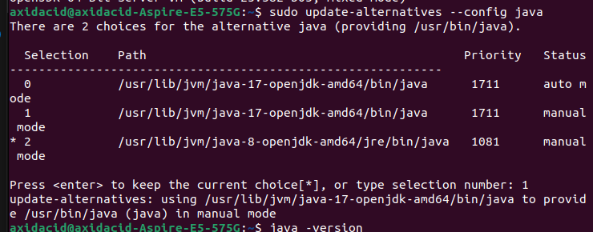

# install java 17 with java 8
1. Install Java 17:  

```
sudo apt update  
sudo apt install openjdk-17-jdk
```

2. Check Available Java Versions & Switch Between Java Versions:
```
sudo update-alternatives --config java
```
When one runs this command you get something like below, enter the number of version which you want to select


3. To cheack active java verision:
```
java -version
```